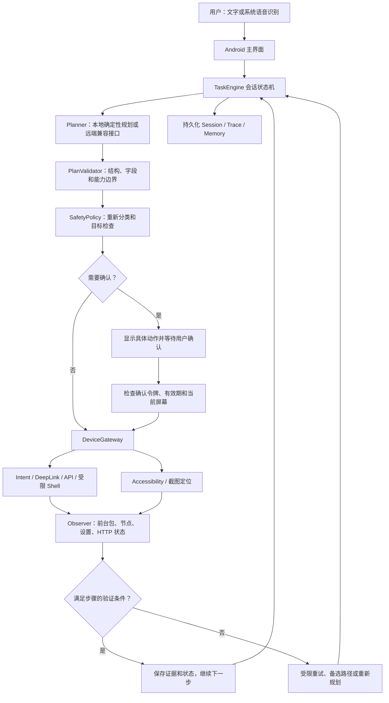

# 舟行 AI：Android 助手架构

本项目是原创 Android MVP。参考的是公开的通用模式：Planner 生成结构化计划，Controller 执行，Observer 获取设备证据，再决定下一步。没有依赖或复制 Qwen Intelligence 的闭源实现。

## 端到端数据流

## 模块边界

| 模块 | 职责 | 不能负责的事情 |
| --- | --- | --- |
| `core` | 平台无关的数据合同、计划验证、安全策略、执行状态机 | 直接操作 Android、相信模型的完成声明 |
| `app` 的 Planner | 生成 `Plan`，必要时根据新截图定位目标或修复计划 | 授权敏感动作、任意执行 Shell、修改安全规则 |
| Android DeviceGateway | 观察设备、调用系统接口、执行受限动作、独立验证结果 | 把“接口已返回”当作业务完成 |
| AccessibilityService | 读取当前窗口、获取截图、精确匹配目标、点击/输入/滚动 | 自动开启无障碍权限、点击密码节点、在未知窗口盲点 |
| 前台任务服务 | 用户启动任务后跨 App 持续运行，显示通知与停止入口 | 隐藏运行、在重启后自动恢复未知副作用 |
| 会话存储 | 保存步骤位置、轨迹和可重用记忆 | 保存模型密钥、把旧的确认令牌作为长期授权 |

核心接口在 `core/src/main/kotlin/dev/phoneagent/core/Contracts.kt`。`Planner` 输出结构化 `Plan`，`DeviceGateway` 提供 `observe / execute / verify`，`SessionStore` 负责本地持久化。Android 权限、网络实现和 Root/Shizuku 不进入核心状态机。

## 一个步骤的执行合同

`PlanStep` 包含唯一标识、标题、有序候选动作、可检查的验证条件，以及有限重试次数。候选动作经验证后按 Intent → DeepLink → API → Shell → 全局导航 → Accessibility → Wait 排序。对于一个特定任务，只尝试它实际提供的候选方案；不能在不存在接口时凭空宣称某个 App 提供 API。

`Action` 是封闭枚举，不能携带任意代码。Shell 只能选择固定的 `ShellOp` 和整数参数。所有 UI 动作必须指定预计前台包名。UI 输入使用精确选择器；选择器点击允许明确的可点击祖先承载其文字标签；坐标点击必须来自当前观察，并落在唯一可点击节点内。缺失、重复、禁用、密码或错误前台 App 的目标必须拒绝。滚动不使用坐标或任意选择器，仅对唯一可见的顶层滚动容器执行。

`ExecutionResult.dispatched` 只表示命令是否发出；`VerificationResult.satisfied` 才能让状态机前进。验证依靠当前前台包、节点文字、系统设置读值或本次请求的 HTTP 状态。HTTP 成功只证明请求返回相应状态；要证明实际业务变化，需要该业务的额外接口或 UI 验证能力。

## 会话、确认与重试

会话状态包括 `CREATED / PLANNING / RUNNING / AWAITING_CONFIRMATION / PAUSED / SUCCEEDED / FAILED / CANCELLED`。每次状态转移保存下一步索引和动作证据，便于查看执行记录与恢复。动作验证成功时，轨迹、下一步索引和在途标记必须在同一次会话写入中提交；结果不确定时，同一次写入保存轨迹、暂停状态和在途标记。`AtomicFile` 保护单次文件写入，不能替代正确的状态转换原子性。

支付、删除、发送消息、变更 API 以及通用 UI 写操作都进入二次确认。模型提供的 `sensitive=false` 不能跳过策略。确认绑定会话、步骤、具体动作和观察指纹，默认两分钟有效且一次性消费；前台包、节点语义或目标边界变化后重新观察、重新确认。观察指纹忽略时间戳和截图像素噪声，坐标动作仍需唯一可点击节点，因此纯视觉无节点对象不在当前执行范围内。确认某个动作不等于批准后续全部步骤。

安全可重复的导航、固定值系统设置和读取可以有限重试。点击、消息、删除、支付以及未知副作用不会因验证超时而自动重复。执行前持久化在途动作；进程在动作与验证之间退出时，先观察并验证原结果，无法判断则暂停。跨 App 连续执行复用同一个会话和步骤轨迹。

重试和备选方案仍失败时，最多调用一次 `Planner.repair` 修复尚未完成的计划后缀。已验证的前缀保持不变；修复结果再次验证结构、预算与安全策略，并拒绝与已验证不可重复动作具有相同执行参数的动作，改写描述或敏感标志不能逃过检查。该检查比较具体动作，不保证语义不同的两个请求不会产生同一种业务效果；新的敏感步骤仍逐次确认。不确定的不可重复副作用直接暂停，不能进入修复。

## 本地与云端规划

`RulePlanner` 支持打开设置/设置子页、按真实安装列表打开 App、访问网址、浏览器搜索，以及已启用 Root/Shizuku 的 WiFi 和亮度控制。可以把“然后”连接的多个支持操作放进同一个计划。它不会把任意复杂自然语言任务伪装为可执行任务，未知操作在操作手机前失败。

`ModelPlanner` 使用用户配置的 OpenAI 格式兼容接口，可接 Qwen 等模型。请求默认提供任务、有限屏幕节点和能力上下文；截图上传默认关闭、单独授权。模型返回必须符合严格 JSON 合同，未知字段和越界参数拒绝。`ground` 只能重新定位目标，不能修改动作类型、输入内容、目标 App 或敏感标志。即使模型提示已检查，状态机仍独立验证设备结果。

任务 API 与模型接口分开。任务 API 默认没有允许主机，只有用户显式设置的 HTTPS 主机可以调用；DNS 返回私网/本机地址或 HTTP 跳转被拒绝。模型 Key 仅发送给配置的模型端点，不转发给任务 API。当前任务 API 合同没有任意请求头/账户凭据功能，需要认证的业务 API 必须再增加明确适配。

## Root、Shizuku 与系统限制

Root 和 Shizuku 是可选执行后端。Root 使用用户设备的 `su` 授权；Shizuku 通过其权限和 UserService 执行固定命令。它们不会绕过应用内敏感操作确认，也不会把任意模型文本传给 Shell。

| 固定操作 | 参数与行为 |
| --- | --- |
| `WIFI_ON / WIFI_OFF` | 开启或关闭 WiFi，不接受附加命令 |
| `BRIGHTNESS` | 整数 `0..255`，先关闭自动亮度，再设置固定亮度 |
| `VOLUME` | 媒体音量整数 `0..15`，还受设备实际最大音量限制 |
| `OPEN_SETTINGS` | 通过固定系统 Intent 打开设置 |

每条命令有超时且保留输出有限；上述执行能力已经实现，不代表已在用户的 Root / Shizuku 真机环境验证通过。当前离线自然语言 Planner 支持其中 WiFi 和亮度控制，其他操作需要模型计划或明确扩展。

Android 11+ 是 MVP 目标。无障碍、录音、通知、Shizuku/Root 均需要设备上真实授权。无障碍服务不能替用户打开自己的权限；安全窗口、密码页、OEM 限制、App 不支持的节点和后台启动限制均可能阻断任务。未获得权限或缺少适配时，任务应给出失败/暂停原因，不能报告已完成。

## 扩展接口

增加新的系统操作时，同时扩展封闭动作合同、字段验证、敏感分类、执行适配器和独立验证。接入具体第三方 App 时，优先增加明确 Intent/DeepLink/API 适配；只在真实不存在接口时使用 UI。为新的不可重复副作用补充中断恢复和确认回归测试。

后续可以增加 App 适配器注册表、更多业务验证、长任务超时和完整视觉坐标映射，但不能降低确认与设备证据要求。设备上实际可用的能力以 README 和验证记录为准。
